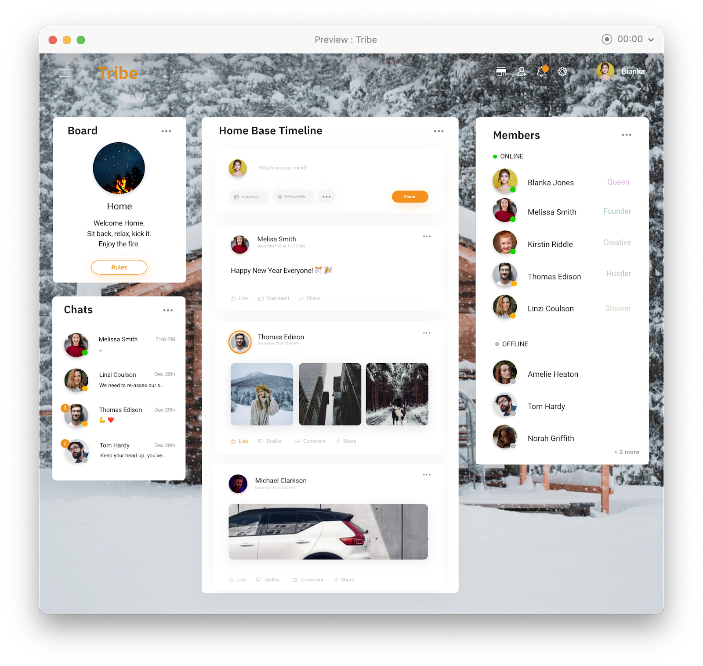

# Tribe (2020)

A social media platform for exclusive social groups centered around a shared passion, interest, or general commonalities.

Tribes mission is to help cultivate an online environment that empowers users to enjoy the content they love while creating create shared intimate moments to keep the flame alive.

## Live Demo

Publicly being hosted at https://tribe-next-js.vercel.app/. If you're curious about what the process looked look to take tribe from ideation to code then you can check out a post I made on [my page](https://www.anthonygayflor.com/tribe)

## Table of Content
- [Tribe (2020)](#tribe-2020)
  - [Live Demo](#live-demo)
  - [Table of Content](#table-of-content)
  - [Problem to solve](#problem-to-solve)
  - [Motivation](#motivation)
  - [Tech Stack](#tech-stack)
  - [Features](#features)
  - [Screenshots](#screenshots)
  - [Lessons Learned](#lessons-learned)
  - [License](#license)
## Problem to solve

During the 2020 pandemic, social media platforms were the most active they had even been as well as the most obnoxious. No matter where you went, you could find irrelevant "noise" (posts) from users you dont know, but somehow they ended up on your feed. This was making it difficult to find meaningful content from the people you cared about at the time.

Our solution to this problem was to provide private online spaces called Tribes that was supposed to be a hybrid of Discord and Facebook. The idea was to give users private spaces like discord for them and their friends, but with the feel of facebook by offering a store of widgets for users to choose depending on their groups needs. As well as a camp fire in all tribes that grows in size and changes color depending on the activity of a tribe; a cool way to show how "lit" it was. 

## Motivation

Tribe initally was meant to be used by others people on college campuses, but the project died before release. Despite this, I wanted to complete it because it would be a good project to have on my resume once I decide to start job hunting; as well as a great learning opprounity to understand fullstack development.

## Tech Stack

**UI\UX Design Tool:** Adobe XD, Miro

**Programming Language:** TypeScript

**Client:** React, Next.Js, TailwindCSS, SWR

**Server:** Node.Js, Express, Bcrypt, Passport.js, Mongoose.js(Mongo DB ORM), Cloudinary, jsonwebtoken, and Multer

**Project Management:** Trello

**Devops:** Vercel and Heroku

## Features

- Email and password authentication.
- HTTP only cookies containing  access tokens.
- Private online spaces Tribe.
- A feed comprised of posts made by members of the tribe
- Cloud storage for uploading images
- Settings for tribe owners to tweak the Tribes name and description.

## Screenshots

*A mockup made in adobe XD of tribes vision*/

## Lessons Learned

Before Tribe, I was only accustumed to creating websites on the client that were either static or connected to an external API. This was my first attempt at building a full stack application in the tradition sense, and i learned:
- **How the client and server communications**
- **What goes into a standalone server handling API requests**
- **The process of actualizing an idea with software**
  
## License

MIT License

Copyright (c) 2024 HyperSets

Permission is hereby granted, free of charge, to any person obtaining a copy of
this software and associated documentation files (the "Software"), to deal in
the Software without restriction, including without limitation the rights to
use, copy, modify, merge, publish, distribute, sublicense, and/or sell copies of
the Software, and to permit persons to whom the Software is furnished to do so,
subject to the following conditions:

The above copyright notice and this permission notice shall be included in all
copies or substantial portions of the Software.

THE SOFTWARE IS PROVIDED "AS IS", WITHOUT WARRANTY OF ANY KIND, EXPRESS OR
IMPLIED, INCLUDING BUT NOT LIMITED TO THE WARRANTIES OF MERCHANTABILITY, FITNESS
FOR A PARTICULAR PURPOSE AND NONINFRINGEMENT. IN NO EVENT SHALL THE AUTHORS OR
COPYRIGHT HOLDERS BE LIABLE FOR ANY CLAIM, DAMAGES OR OTHER LIABILITY, WHETHER
IN AN ACTION OF CONTRACT, TORT OR OTHERWISE, ARISING FROM, OUT OF OR IN
CONNECTION WITH THE SOFTWARE OR THE USE OR OTHER DEALINGS IN THE SOFTWARE.

